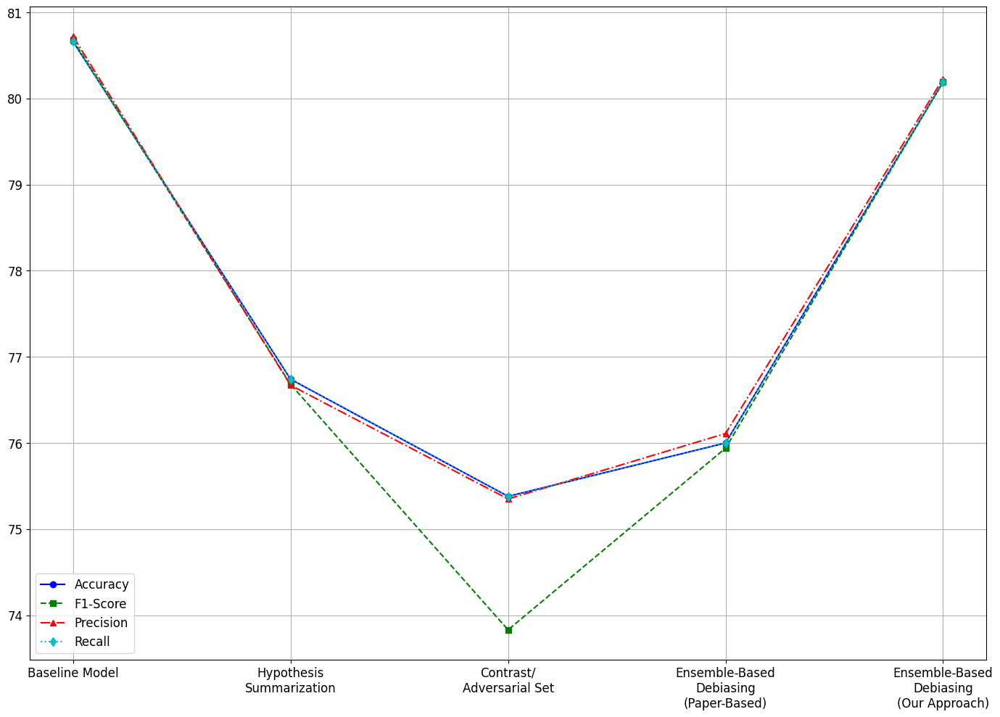

# Exploring Weak-Strong Model Dynamics for Robustness Against Dataset Artifacts in MultiNLI

**Description:**

 This study addresses dataset artifacts in NLP tasks, particularly in the MultiNLI dataset, which often lead models to rely on spurious correlations instead of genuine semantic understanding. By fine-tuning the ELECTRA-small model, the research achieved a baseline accuracy of 80.66%. To enhance robustness, the study employed contrast sets and synthetically generated adversarial examples to probe model vulnerabilities. A weak-strong model ensemble framework was introduced, where the weak model captured superficial artifacts, and the strong model learned residuals to focus on deeper semantic patterns. Combining logits from both models during inference improved overall accuracy to 80.19% while maintaining robustness against artifacts. Additional techniques like hypothesis summarization and adversarial training further refined performance, particularly for challenging genres like "slate." The findings emphasize the importance of targeted interventions to improve generalization and robustness in NLP systems. 

**Report:** [[Technical report](https://github.com/emmanuelrajapandian/emmanuelrajapandian.github.io/blob/3d9f9b165477156cd4421619041f15f51668458d/files/NLP%20Project%20Report.pdf)]

**Outcome:**

 The baseline model achieved a global accuracy of 80.66%, providing a solid foundation but showing limitations in handling complex linguistic structures. Our revised approach, which combined logitsfrom both weak and strong models, resulted in a slightly lower global accuracy of 80.19%. Despite this decrease, combining outputs effectively leveraged the strengths of both models,demonstrating the benefits of integrating outputs to address dataset artifacts and its ability in handling different linguistic inputs. 

  

